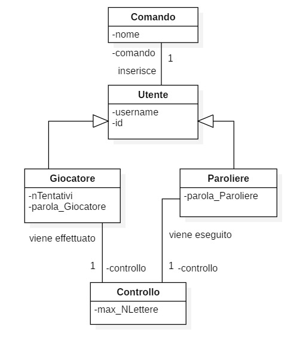
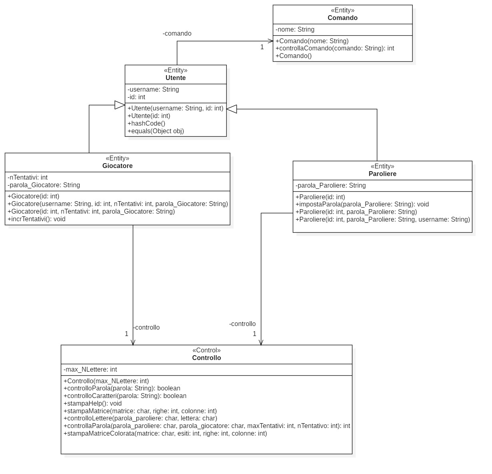
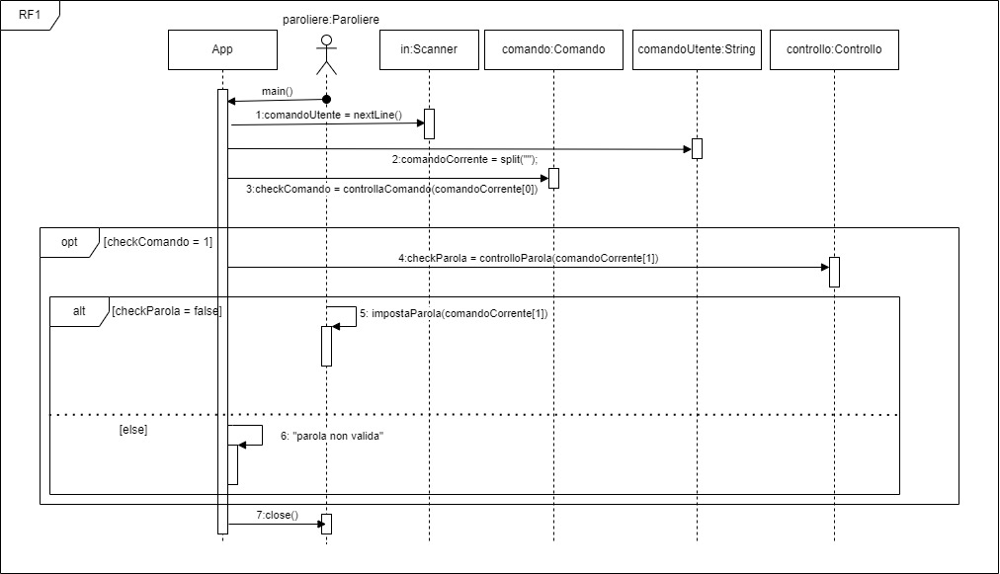
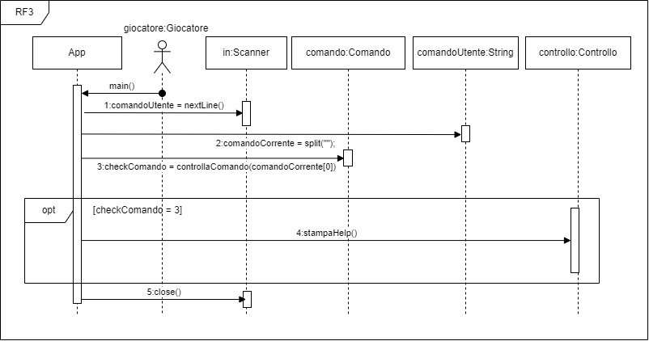
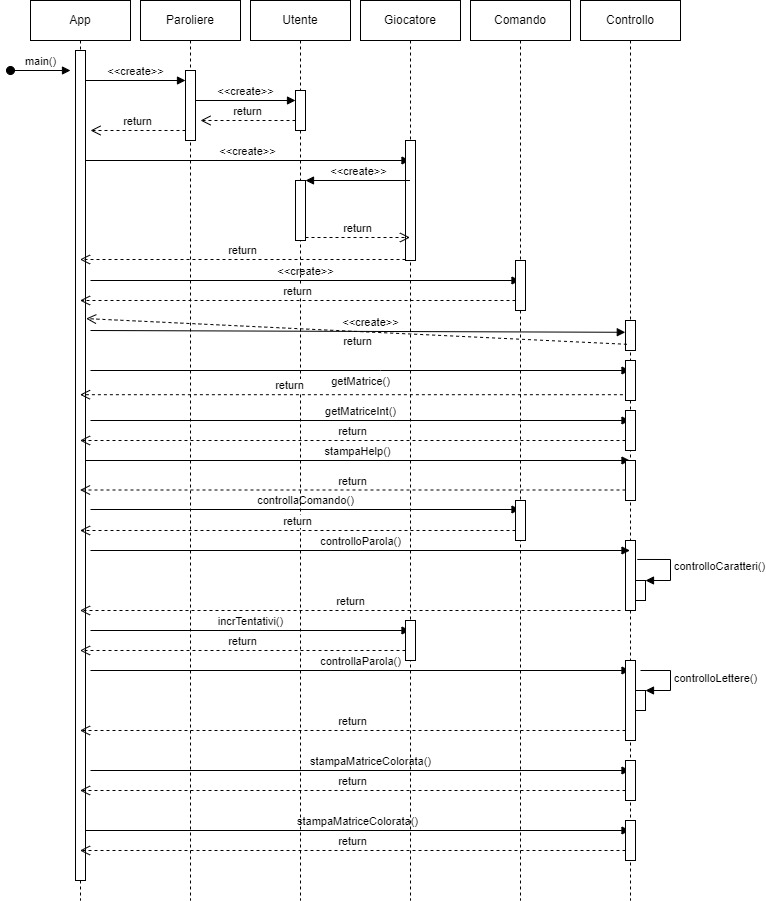

# Report
# 1. Introduzione
La seguente relazione tecnica è relativa alla creazione del gioco di parole chiamato Wordle, ispirato all'omonimo gioco presente sul sito The New York Time, pubblicato da Josh Wardle nel 2021. In termini pratici, l'obiettivo del gioco è quello di indovinare una parola nascosta formata da un numero di lettere prestabilito, solitamente cinque, in un numero massimo di tentativi, anch'esso deciso in precedenza (solitamente 6). 
In questo gioco esistono due ruoli fondamentali, ovvero il paroliere e il giocatore. Il paroliere ha il compito di andare ad impostare nel gioco una parola segreta che il giocatore dovrà indovinare mentre il giocatore dovrà appunto cercare di indovinare la parola entro il numero di tentativi stabiliti. Nel gioco originale:
1)  Se una lettera diventa verde vuol dire che abbiamo indovinato la sua posizione nella parola. 
2)  Se è gialla significa che quella lettera è inclusa nella parola ma non nella posizione giusta. 
3) Se è grigia significa che non compare nella parola. 

La realizzazione del gioco è stata suddivisa in 3 sprint diversi. A partire dallo Sprint 0 fino ad arrivare allo Sprint 2. È stato adottato lo sviluppo agile e sono stati seguiti i 12 principi stabiliti dal framework di sviluppo Scrum. Il progetto è stato sviluppato tramite il linguaggio Java con l’aiuto della piattaforma GitHub per la creazione di un repository apposito per il progetto per il corso di Ingegneria del Software.

# 2. Modello di dominio

# 3. Requisiti specifici
### **3.1 Requisiti funzionali**
Per ogni user story devono essere soddisfatti i seguenti requisiti 

1) C'è un issue con label «user story» 

2) In ogni issue è presente  un Milestone e  una Project Board 

3) Assegnazione a uno o al più due componenti del team 

4) Ogni classe è preceduta da un commento che riassume la responsabilità    della classe 

5) Ogni classe è preceduta da un commento per indicare se è di tipo <<Entity>>, <<Control>>, <<Boundary>>, <<noECB>> 

6) i commenti iniziano con /** e terminano con with */ 

7) I commit devono avere una descrizione breve ma significativa 

8) C'è una Pull Request (PR) che corrisponde alla user story 

9) La PR è in un Milestone ma non in una Project Board 

10) C'è un commento che linka la PR all'issue (es. "closes #22") 

11) La PR è accettata a review avvenuto ed esplicito 

12) Build costruito con successo

13) Docker image caricata con successo 

14) L'esecuzione rispetta i criteri di accettazione 
 
### **3.2 Requisiti non funzionali**

Nel progetto avremo i seguenti requisiti non funzionali: 

1) RNF1: il container docker dell’app deve essere eseguito da terminali che supportano Unicode con encoding UTF-8 o UTF-16. 

2) Elenco di terminali supportati 

    Linux: 
    - Terminal 

    Mac OS: 
    - Terminal

    Windows: 
    - Powershell 
    - Git Bash (in questo caso il comando Docker ha come prefisso winpty; es: winpty docker -it ....) 

Comando per l’esecuzione del container 
Dopo aver eseguito il comando docker pull copiandolo da GitHub Packages, Il comando Docker da usare per eseguire il container contenente l’applicazione è: 

docker run --rm -it ghcr.io/softeng2122-inf-uniba/wordle-base2122:latest 
dove base2122 sarà sostitituito con il nome del gruppo. 

# 5. OO Design

Dopo un’attenta analisi dei requisiti funzionali, abbiamo trovato le seguenti classi: 

1) **Comando**: la classe Comando è una classe di tipo Entity e rappresenta caratteristiche e comportamenti che può assumere un comando. Di conseguenza, la responsabilità di questa classe è quella di gestire i comandi inseriti sia dall’utente di tipo giocatore che dall’utente di tipo paroliere. 

2) **Utente**: la classe Utente è una classe di tipo Entity e rappresenta caratteristiche e comportamenti che può assumere un utente generale. La responsabilità di questa classe è quella di gestire l’utente generico e fa da classe padre alle seguenti classi: 

    - **Giocatore**: la classe Giocatore è una classe di tipo Entity e rappresenta caratteristiche e comportamenti che può assumere un utente di tipo giocatore.  
    La responsabilità di questa classe è quella di gestire il giocatore durante tutta la durata della partita. 
    - **Paroliere**: la classe Paroliere è una classe di tipo Entity e rappresenta caratteristiche e comportamenti che può assumere un utente di tipo paroliere.  
    La responsabilità di questa classe è quella di gestire il paroliere durante tutta la durata della partita. 

3) **Controllo**: la classe controllo è una classe di tipo Control e ha la responsabilità di effettuare dei controlli sulle parole che vengono inserite dall’utente di tipo paroliere e dall’utente di tipo giocatore. 

Diagramma delle classi dal punto di vista software:

RF1:

RF3:

RF6:

